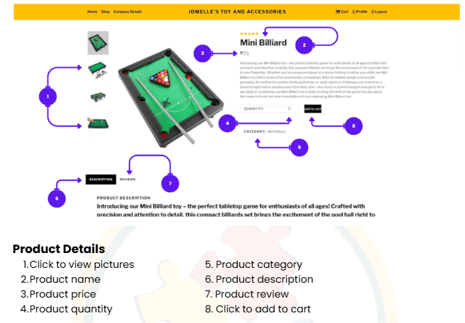

# 📖 Project User Manual
**Product Management & Order Fulfillment System**

This manual serves as a comprehensive guide to the features and functionalities of the platform. Designed for both end-users and administrators, it covers the full lifecycle from account creation to finalized order placement.

---

## 🏛️ 1. Corporate Identity & Overview
Understanding the foundation of the platform.

* **Mission & Vision:** View our core values and long-term goals.

* **Company Details:** Essential business information and contact data.

---

## 🔐 2. Access & Security
A secure environment for managing user sessions and data protection.

### Onboarding
* **Sign In:** Access your personalized dashboard.

* **Sign Up:** Create a new account with secure field validation.

### Account Recovery & Maintenance
* **Password Management:** Secure workflow for lost credentials.

* **Profile Settings:** Update personal information and preferences in real-time.

---

## 🏠 3. The Interface (UX/UI)
The platform is built with a focus on ease of navigation and high product discoverability.

* **Main Dashboard:** The central hub for all platform activities.

* **Product Cataloging:** Organized views to help users find exactly what they need.

---

## 🛒 4. Order & Transaction Workflow
A streamlined process from product selection to final acquisition.

### Product Selection
* **Deep-Dive Views:** Detailed specifications, pricing, and availability for every item.

### The Checkout Process
1. **Order Review:** Finalize quantities and check item summaries.

2. **Secure Transaction:** Input-validated checkout form to ensure data accuracy.

---

## 📂 5. External Documentation
For a fully formatted version of this guide with high-resolution layouts, please refer to the digital document below:

* 📄 [Download Full User Manual (PDF)](user-manual.pdf)

---
*Developed by John Ivan Ello | 2023*
